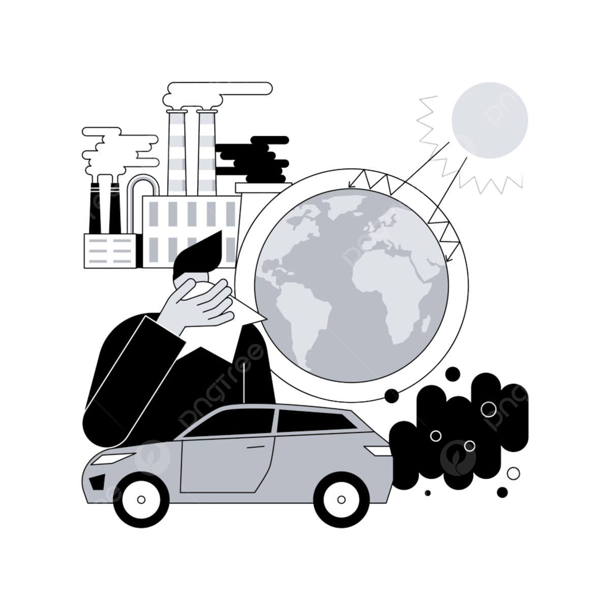

# 📌 Impacto ambiental del sector TI

El sector de Tecnología de la Información (TI) tiene un impacto significativo en el medio ambiente debido a diversos factores:

---
### 🔋 Alto consumo energético de los centros de datos

Los centros de datos requieren grandes cantidades de energía para operar y mantener temperaturas adecuadas, lo que contribuye a un alto consumo eléctrico.

¿Qué impacto ambiental tiene el consumo energético de los centros de datos?
El alto consumo energético de los centros de datos contribuye a la emisión de gases de efecto invernadero y al agotamiento de recursos naturales no renovables.

---
### 🖥️ Generación de residuos electrónicos

La obsolescencia tecnológica rápida genera grandes volúmenes de desechos electrónicos, muchos de los cuales contienen materiales tóxicos.

¿Por qué es importante reciclar los dispositivos electrónicos?
El reciclaje adecuado evita la contaminación del medio ambiente y permite recuperar materiales valiosos.

---
### 🌍 Emisiones de CO₂ y contaminación

La producción y eliminación de dispositivos electrónicos, así como el consumo de energía basado en combustibles fósiles, contribuyen a la emisión de gases de efecto invernadero.

